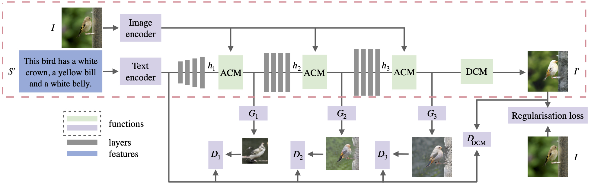

# ManiGAN 
Pytorch implementation for ManiGAN: Text-Guided Image Manipulation. The goal is to semantically edit parts of an image according to the given text while preserving text-irrelevant contents.

### Overview


**[ManiGAN: Text-Guided Image Manipulation](https://arxiv.org/abs/1912.06203).**  
[Bowen Li](https://mrlibw.github.io/), [Xiaojuan Qi](https://xjqi.github.io/), [Thomas Lukasiewicz](http://www.cs.ox.ac.uk/people/thomas.lukasiewicz/), [Philip H. S. Torr](http://www.robots.ox.ac.uk/~phst/).<br> University of Oxford <br> CVPR 2020 <br>

### Data

1. Download the preprocessed metadata for [bird](https://drive.google.com/file/d/1b8wxdYjZEV-oznxL3PohL84vuKlBW6Mm/view?usp=sharing) and [coco](https://drive.google.com/file/d/12xuNBDCsnjIhuaP3s2DGsufyfArWc5Dw/view?usp=sharing), and save both into `data/`
2. Download [bird](http://www.vision.caltech.edu/visipedia/CUB-200-2011.html) dataset and extract the images to `data/birds/`
3. Download [coco](http://cocodataset.org/#download) dataset and extract the images to `data/coco/`

### Training
All code was developed and tested on CentOS 7 with Python 3.7 (Anaconda) and PyTorch 1.1.

#### [DAMSM](https://github.com/taoxugit/AttnGAN) model includes text encoder and image encoder
- Pre-train DAMSM model for bird dataset:
```
python pretrain_DAMSM.py --cfg cfg/DAMSM/bird.yml --gpu 0
```
- Pre-train DAMSM model for coco dataset: 
```
python pretrain_DAMSM.py --cfg cfg/DAMSM/coco.yml --gpu 1
```
#### ManiGAN, main module
- Train main module for bird dataset:
```
python main.py --cfg cfg/train_bird.yml --gpu 2
```
- Train main module for coco dataset: 
```
python main.py --cfg cfg/train_coco.yml --gpu 3
```

`*.yml` files include configuration for training and testing.

#### ManiGAN, detail correction module (DCM)
Save trained main module to `models/`

- Train DCM for bird dataset:
```
python DCM.py --cfg cfg/train_bird.yml --gpu 2
```
- Train DCM for coco dataset: 
```
python DCM.py --cfg cfg/train_coco.yml --gpu 3
```

#### Pretrained DAMSM Model
- [DAMSM for bird](https://drive.google.com/file/d/1ZqlwNWIaV4KblBwZ6eqlX9-_SzLlP17h/view?usp=sharing). Download and save it to `DAMSMencoders/`
- [DAMSM for coco](https://drive.google.com/file/d/1ewMMhCDf-QfAD_vs07ZFgg2L9quIKRUN/view?usp=sharing). Download and save it to `DAMSMencoders/`
#### Pretrained ManiGAN Model
- [Main module for bird](https://drive.google.com/file/d/1X8GU4tXP-lc_YVqR1Rq9Jx6SIkQlKdje/view?usp=sharing). Download and save it to `models/`

- [Main module for coco](https://drive.google.com/file/d/1jl8mNnb9_y6Uj8UIj-_yzzGxfmxOCX8c/view?usp=sharing). Download and save it to `models/`

- [DCM for bird](https://drive.google.com/file/d/1Wgu402wLWXEmZRIsq_NV22WvzYQZCMX5/view?usp=sharing). Download and save it to `models/`

- [DCM for coco](https://drive.google.com/file/d/1Fjx71tWt8Ec0dvqtTeGj0kS5J46GwtZA/view?usp=sharing). Download and save it to `models/`

### Testing
- Test ManiGAN model for bird dataset:
```
python main.py --cfg cfg/eval_bird.yml --gpu 4
```
- Test ManiGAN model for coco dataset: 
```
python main.py --cfg cfg/eval_coco.yml --gpu 5
```
### Evaluation

- To generate images for all captions in the testing dataset, change B_VALIDATION to `True` in the eval_*.yml. 
- Inception Score for bird dataset: [StackGAN-inception-model](https://github.com/hanzhanggit/StackGAN-inception-model).
- Inception Score for coco dataset: [improved-gan/inception_score](https://github.com/openai/improved-gan/tree/master/inception_score).

### Code Structure
- code/main.py: the entry point for training the main module and testing ManiGAN.
- code/DCM.py: the entry point for training the DCM.
- code/trainer.py: creates the main module networks, harnesses and reports the progress of training.
- code/trainerDCM.py: creates the DCM networks, harnesses and reports the progress of training.
- code/model.py: defines the architecture of ManiGAN.
- code/attention.py: defines the spatial and channel-wise attentions.
- code/VGGFeatureLoss.py: defines the architecture of the VGG-16.
- code/datasets.py: defines the class for loading images and captions.
- code/pretrain_DAMSM.py: trains the text and image encoders, harnesses and reports the progress of training. 
- code/miscc/losses.py: defines and computes the losses for the main module.
- code/miscc/lossesDCM.py: defines and computes the losses for DCM.
- code/miscc/config.py: creates the option list.
- code/miscc/utils.py: additional functions.

### Citation

If you find this useful for your research, please use the following.

```
@article{li2019manigan,
  title={ManiGAN: Text-Guided Image Manipulation},
  author={Li, Bowen and Qi, Xiaojuan and Lukasiewicz, Thomas and Torr, Philip HS},
  journal={arXiv preprint arXiv:1912.06203},
  year={2019}
}
```

### Acknowledgements
This code borrows heavily from [ControlGAN](https://github.com/mrlibw/ControlGAN) repository. Many thanks.
